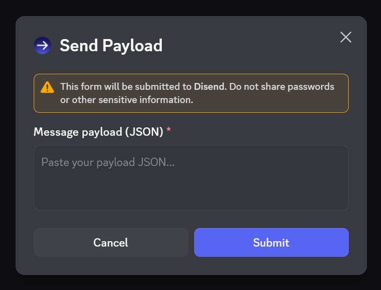
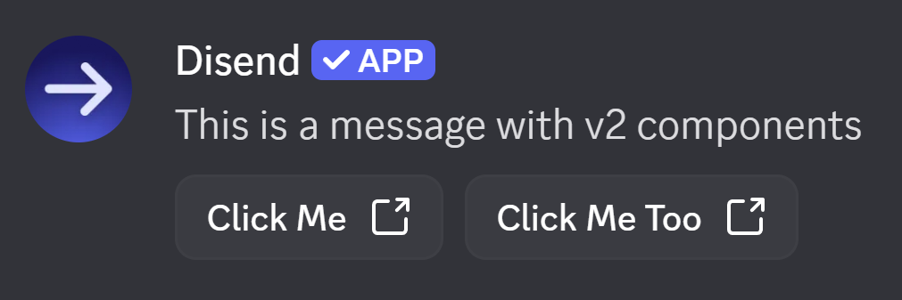
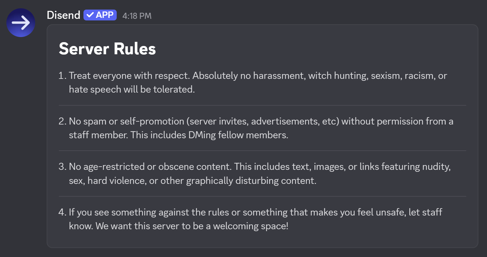

# Disend

[](https://github.com/ryanlua/disend/actions/workflows/ci.yml)
[](https://discord.gg/XkAHS8MkTe)
[](https://github.com/ryanlua/disend?tab=MIT-1-ov-file#readme)
[](https://biomejs.dev)

Send message components on your Discord server with Disend. Create high-quality rules, FAQs, and more on any channel and self-host the app for a professional look.

## Message Payloads

The `/send` command allows you to send a [message with a component](https://docs.discord.com/developers/components/using-message-components). 



Apps like [Discohook](https://discohook.app/) allow you to create the message payloads and then copy the JSON to send with Disend.

### Example payloads

<details>

<summary>Message with link buttons</summary>

```json
{
  "flags": 32768,
  "components": [
    {
      "type": 10,
      "content": "This is a message with v2 components"
    },
    {
      "type": 1,
      "components": [
        {
          "type": 2,
          "style": 5,
          "label": "Click Me",
          "url": "https://example.com/"
        },
        {
          "type": 2,
          "style": 5,
          "label": "Click Me Too",
          "url": "https://example.com/"
        }
      ]
    }
  ]
}
```



</details>

<details>

<summary>Server rules</summary>

```json
{
  "flags": 32768,
  "components": [
    {
      "type": 17,
      "components": [
        {
          "type": 10,
          "content": "# Server Rules"
        },
        {
          "type": 10,
          "content": "1. Treat everyone with respect. Absolutely no harassment, witch hunting, sexism, racism, or hate speech will be tolerated."
        },
        {
          "type": 14
        },
        {
          "type": 10,
          "content": "2. No spam or self-promotion (server invites, advertisements, etc) without permission from a staff member. This includes DMing fellow members."
        },
        {
          "type": 14
        },
        {
          "type": 10,
          "content": "3. No age-restricted or obscene content. This includes text, images, or links featuring nudity, sex, hard violence, or other graphically disturbing content."
        },
        {
          "type": 14
        },
        {
          "type": 10,
          "content": "4. If you see something against the rules or something that makes you feel unsafe, let staff know. We want this server to be a welcoming space!"
        }
      ]
    }
  ]
}
```



</details>

## Self-hosting

Self hosting is free and allows you to customize what Disend looks like. If you want to self-host Disend, follow the instructions in the [contributing guidelines](CONTRIBUTING.md).

## Support Server

If you have any questions, suggestions, or need help with Disend, feel free to join the support server on Discord.

* Share feedback or your experience
* Get technical support with Disend
* Be the first to know about updates

Disend is a project under [Disclip](https://github.com/ryanlua/disclip) and uses the Disclip server for support.

[](https://discord.gg/XkAHS8MkTe)
