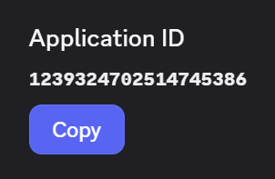
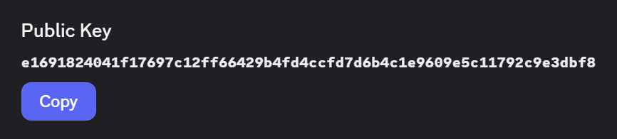
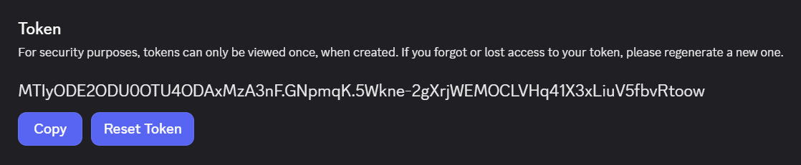

# Disend

Send message components on your Discord server with Disend. Create high-quality rules, FAQs, and more on any channel and self-host the app for a professional look.

## Hosting your own Disend clone

> [!TIP]
> This guide is for developers who want to set up their own Disend clone. You can install the official Disend app using the [install link](https://discord.com/oauth2/authorize?client_id=1239324702514745386).

Disend is powered by [Cloudflare Workers](https://workers.cloudflare.com/) which requires you to [create a Cloudflare account](https://developers.cloudflare.com/fundamentals/account/create-account/). You only need a [Workers Free plan](https://developers.cloudflare.com/workers/platform/limits/#worker-limits) and don't need to pay anything.

It is recommended you [make your first Discord app](https://discord.com/developers/docs/quick-start/getting-started) before you start setting up Disend, so you are familiar with the Discord Developer Portal and how to create an app. Additionally, you can follow the [deploying Discord apps on Cloudflare Workers tutorial](https://docs.discord.com/developers/tutorials/hosting-on-cloudflare-workers) to get a better understanding of how hosting Discord apps on Cloudflare Workers works in general.

This guide will walk you through the steps to create, configure, and deploy your own Disend clone without needing to write any code or install anything on your machine.

### Deploying to Cloudflare Workers

You will need to [create a Discord app](https://discord.com/developers/applications?new_application=true) in the Discord Developer Portal if you haven't already.

After you create your app, you'll land on the **General Information** page of the app's settings where you can update basic information about your app like its description and icon.

Here you will also find your app credentials that Cloudflare needs to deploy your Disend clone.

[Create the Disend Workers application](https://deploy.workers.cloudflare.com/?url=https%3A%2F%2Fgithub.com%2Fryanlua%2Fdisend) or click the **Deploy to Cloudflare** button on the top of this page and enter the following values from your Discord app's settings:

* On the **General Information** page, copy the value for **Application ID**. In Cloudflare, enter your pasted value in `DISCORD_APPLICATION_ID`

  

* Back on the **General Information** page, copy the value for **Public Key**. In Cloudflare, enter your pasted value in `DISCORD_PUBLIC_KEY`

  

* On the **Bot** page under **Token**, click "Reset Token" to generate a new bot token. In Cloudflare, enter your pasted value in `DISCORD_TOKEN`

  

> [!WARNING]
> Make sure to never share your token or check it into any kind of version control or someone could take control of your bot.
